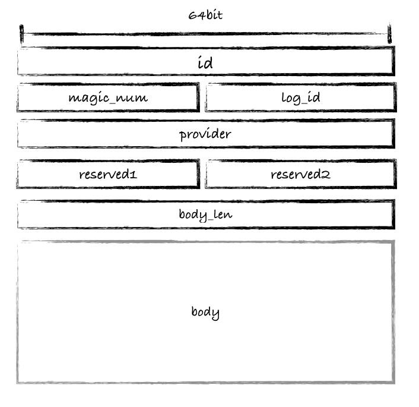

# what's ghead

`ghead`是一个RPC通信协议TCP层的数据包包头统一格式定义。

# why ghead

为了解决应用层网络通信中的半包、粘包问题，需要定义统一的协议包头，通过指定数据包的长度来控制数据的接受、发送操作。`ghead`数据包头定义如下：



与此同时，`ghead`还提供了可以向下游读写完整数据包的API：`gread`和`gwrite`，可简化底层网络通信的实现。

# quick start

编译`libghead.a`以及demo程序`ghead_server`和`ghead_client`:

```shell
$ mkdir build
$ cd build
$ cmake ../
$ make
```

在terminal1中执行服务端demo：

```shell
$ ./ghead_server
```

在terminal2中执行客户端demo并输入字符:

```shell
$ ./ghead_client
```

# API

从sock中读取一个完整的数据包，head为接收缓冲区，buflen为接收缓冲区的长度，timeout为超时时间(毫秒)。
```cpp
static RETURN_CODE gread(int sock, ghead* head, size_t buflen, int timeout);
```

向socket发送一个完整的数据包，head为发送缓冲区，buflen为发送缓冲区的长度，timeout为超时时间(毫秒)。
```cpp
static RETURN_CODE gwrite(int sock, ghead* head, size_t buflen, int timeout);
```


